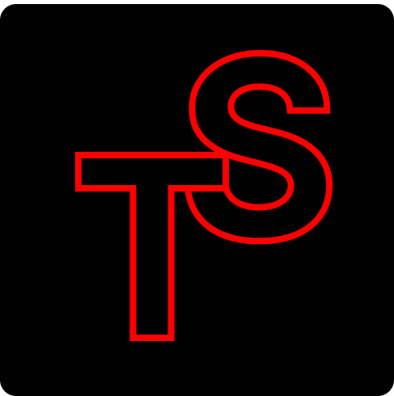

<div align="center">
  
  
  # TimeSwift
  
  [](./LICENSE)
  [](https://kit.svelte.dev/)
  [](https://tauri.app)

  Eine moderne Zeiterfassungs- und Projektmanagement-Desktop-Anwendung
</div>

## 🚀 Features

- **⏱️ Zeiterfassung** - Präzise Erfassung von Arbeitszeiten
- **📊 Dashboard** - Übersichtliche Visualisierung wichtiger Daten
- **👥 Projektverwaltung** - Organisation von Projekten und Kunden
- **📈 Auswertungen** - Detaillierte Reports und Statistiken
- **🔄 Synchronisation** - Online/Offline mit SurrealDB
- **🛡️ Sicherheit** - Verschlüsselte Datenspeicherung

## 🔧 Tech-Stack
- Frontend: Tauri + SvelteKit + TypeScript
- Backend: Typescript  
- Datenbank: SurrealDB
- Testing: Vitest


## 🛠️ Entwicklung

```bash
# Repository klonen
git clone https://github.com/your-username/timeswift.git
cd timeswift

# Dependencies installieren
npm install

# Entwicklungsserver starten
npm run dev

# Tauri App entwickeln
npm run tauri dev

# Produktions-Build erstellen
npm run tauri build
```

## 📦 Installation

```bash
# Repository klonen
git clone https://github.com/your-username/timeswift.git

# Ins Verzeichnis wechseln
cd timeswift

# Dependencies installieren
npm install
```

## 📝 Lizenz

Dieses Projekt verwendet eine eigene Lizenzvereinbarung. Details finden Sie in der [Lizenzdatei](./LICENSE).

[](./LICENSE)


